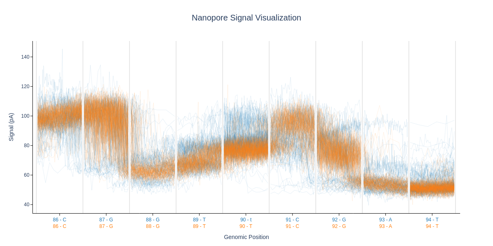
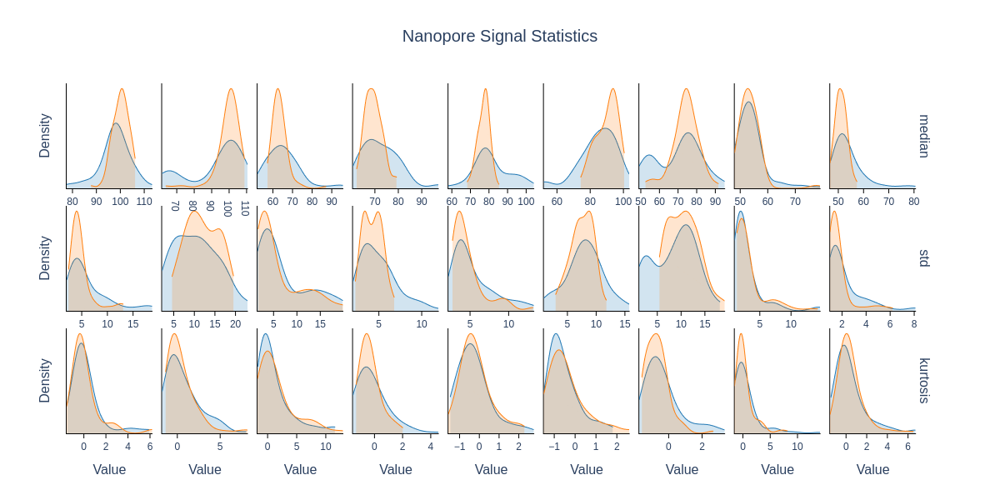

# CurrentView

A Python package for visualizing nanopore sequencing signals at specific genomic positions. This tool enables researchers to plot and compare signal patterns from POD5 files aligned to reference genomes via BAM files.

## Features

- **Signal Visualization**: Plot nanopore signals from POD5 files at specific genomic positions
- **Multi-condition Comparison**: Overlay multiple conditions/samples for direct comparison
- **Statistical Analysis**: Calculate and visualize statistics across positions
- **GMM Fitting**: Fit Gaussian Mixture Models for advanced analysis

## Output sample




## Table of Contents
- [CurrentView](#currentview)
  - [Features](#features)
  - [Output sample](#output-sample)
  - [Table of Contents](#table-of-contents)
  - [Installation](#installation)
    - [Dependencies](#dependencies)
  - [Quick Start](#quick-start)
  - [Core API](#core-api)
    - [GenomicPositionVisualizer](#genomicpositionvisualizer)
      - [Main Methods](#main-methods)
        - [add\_condition()](#add_condition)
        - [update\_condition()](#update_condition)
        - [show(), show\_signals(), and show\_stats()](#show-show_signals-and-show_stats)
        - [save(), save\_signals(), and save\_stats()](#save-save_signals-and-save_stats)
      - [Other Methods](#other-methods)
        - [GMM Methods](#gmm-methods)
    - [Styling and Customization](#styling-and-customization)
      - [Examples](#examples)
  - [Practical Considerations](#practical-considerations)
    - [Performance Optimization](#performance-optimization)
    - [Visual Clarity](#visual-clarity)
    - [Common Issues](#common-issues)
  - [License](#license)
  - [Citation](#citation)

## Installation

```bash
git clone https://github.com/genometechlab/currentview.git
cd currentview
pip install -e .
```

### Dependencies
- numpy >= 1.20.0
- matplotlib >= 3.5.0
- pysam >= 0.19.0 (for BAM file reading)
- pod5 >= 0.2.0 (for POD5 file reading)
- plotly >= 6.2.0
- nbformat >= 5.10.4

## Quick Start

```python
from currentview import GenomicPositionVisualizer, PlotStyle

# Create visualizer for a 9-base window with statistics
viz = GenomicPositionVisualizer(K=9, stats=['mean', 'std', 'median'])

# Add signals from a genomic position
viz.add_condition(
    bam_path="sample1.bam",
    pod5_path="sample1.pod5",
    contig="chr1",
    target_position=100,
    label="Control"
)

# Add another condition for comparison
viz.add_condition(
    bam_path="sample2.bam",
    pod5_path="sample2.pod5",
    contig="chr1",
    target_position=100,
    label="Treatment",
    color="red"
)

# Display the signal plot
viz.show_signals()

# Display the stats plot
viz.show_stats()

# Or display both
viz.show()
```

**Implementation examples are provided under example folder**

## Core API

### GenomicPositionVisualizer

The main class for visualization.

```python
GenomicPositionVisualizer(
    K: int = 9,
    kmer: Optional[List[Union[str, int]]] = None,
    stats: Optional[List[Union[str, Callable]]] = None,
    signal_processing_fn: Optional[callable] = None,
    signals_plot_style: Optional[PlotStyle] = None,
    stats_plot_style: Optional[PlotStyle] = None,
    color_palette: Optional[Union[str, ColorPalette]] = None,
    title: Optional[str] = None,
    verbosity: VerbosityLevel = VerbosityLevel.SILENT,
    logger: Optional[logging.Logger] = None
)
```

**Parameters:**
- `K`: Window size (will be made odd if even). Default: 9
- `kmer`: Optional custom k-mer labels for x-axis. Should be an iterable with size `K`
- `stats`: List of statistics to include. Supports `'mean'`, `'median'`, `'std'`, `'variance'`, `'min'`, `'max'`, `'skewness'`, `'kurtosis'`, and user-defined callables
- `signal_processing_fn`: Optional callable for custom signal processing
- `signals_plot_style`: PlotStyle object for signal visualization customization
- `stats_plot_style`: PlotStyle object for stats visualization customization
- `color_palette`: Color palette name (string) or ColorPalette instance
- `title`: Plot title
- `verbosity`: Logging level (0-4 or VerbosityLevel enum):
  - 0 = SILENT: No output
  - 1 = ERROR: Only errors
  - 2 = WARNING: Errors and warnings
  - 3 = INFO: Errors, warnings, and info
  - 4 = DEBUG: Everything including debug messages
- `logger`: Optional custom logger instance

#### Main Methods

##### add_condition()

Add and process a new condition from BAM and POD5 files.

```python
viz.add_condition(
    bam_path: Union[str, Path],
    pod5_path: Union[str, Path],
    contig: str,
    target_position: int,
    *,
    molecule_type: str = "RNA",
    matched_query_base: Optional[str] = None,
    read_ids: Optional[Union[Set[str], List[str]]] = None,
    max_reads: Optional[int] = None,
    exclude_reads_with_indels: bool = False,
    label: Optional[str] = None,
    color: Optional[str] = None,
    alpha: Optional[float] = None,
    line_width: Optional[float] = None,
    line_style: Optional[str] = None
) -> GenomicPositionVisualizer
```

**Parameters:**
- `bam_path`: Path to BAM alignment file (required)
- `pod5_path`: Path to POD5 signal file (required)
- `contig`: Chromosome/contig name, e.g., "chr1" (required)
- `target_position`: 1-based reference genomic position (required)
- `molecule_type`: Type of molecule, "RNA" or "DNA" (default: "RNA")
- `matched_query_base`: Expected base at target position for validation (default: None)
- `read_ids`: Specific read IDs to include (default: None - all aligned reads)
- `max_reads`: Maximum number of reads to process (default: None - no limit)
- `exclude_reads_with_indels`: Skip reads with insertions/deletions (default: False)
- `label`: Condition name (default: `{contig}:{target_position}`)
- `color`: Line color (default: auto-assigned from palette)
- `alpha`: Line transparency 0-1 (default: auto-calculated based on read count)
- `line_width`: Line thickness (default: from style)
- `line_style`: Line style: `"solid"`, `"dash"`, `"dot"`, `"dashdot"` (default: from style)

##### update_condition()

Update visualization parameters of an existing condition.

```python
viz.update_condition(
    label: str,
    *,
    color: Optional[str] = None,
    alpha: Optional[float] = None,
    line_width: Optional[float] = None,
    line_style: Optional[str] = None
) -> GenomicPositionVisualizer
```

##### show(), show_signals(), and show_stats()

```python
# Display both signals and stats plots
viz.show()

# Display only the signals plot
viz.show_signals()

# Display only the stats plot
viz.show_stats()
```

##### save(), save_signals(), and save_stats()

```python
# Save both plots (adds _signals and _stats suffixes)
viz.save(path="output.png", format='png', scale=1)

# Save only signals plot
viz.save_signals(path="signals.png", format='png', scale=1)

# Save only stats plot
viz.save_stats(path="stats.png", format='png', scale=1)
```

#### Other Methods

```python
# Highlight a position in the window
viz.highlight_position(window_idx=4, color='red', alpha=0.2)

# Highlight the center position
viz.highlight_center(color='red', alpha=0.2)

# Remove all highlights
viz.clear_highlights()

# Add text annotation
viz.add_annotation(window_idx=4, text="SNP", y_position=150)

# Remove annotations
viz.clear_annotations()

# Set plot title
viz.set_title("Signal comparison at chr1:1000000")

# Set y-axis limits
viz.set_ylim(bottom=50, top=200)

# Get/print summary
summary = viz.get_summary()
viz.print_summary()

# Remove a condition
viz.remove_condition("Control")

# Clear all conditions
viz.clear()

# Get condition names
names = viz.get_condition_names()

# Get specific condition
cond = viz.get_condition("Control")

# Change verbosity
viz.set_verbosity(3)  # Set to INFO level

# Update styles
viz.set_signals_style(new_style)
viz.set_stats_style(new_style)
```

##### GMM Methods

Fit and visualize Gaussian Mixture Models:

```python
# Fit GMMs and get results
gmm_results = viz.fit_gmms(
    stat1='mean',
    stat2='std',
    K=5,  # Optional: use smaller window
    gmm_config=GMMConfig(...),
    preprocess_config=PreprocessConfig(...)
)

# Fit and plot GMMs
gmm_viz = viz.plot_gmms(
    stat1='mean',
    stat2='std',
    K=5
)
```

### Styling and Customization

The appearance of plots can be customized using the `PlotStyle` class:

```python
from currentview.utils.plotly_utils import PlotStyle
from currentview.utils.color_utils import ColorPalette

# Create custom style
style = PlotStyle(
    width=1200,           # pixels
    height=800,           # pixels
    line_width=2.0,
    line_style="solid",   # "solid", "dash", "dot", "dashdot"
    opacity_mode='auto',  # 'auto' or 'fixed'
    fixed_opacity=0.8,
    fill_opacity=0.3,
    # ... more options
)

viz = GenomicPositionVisualizer(
    K=9,
    signals_plot_style=style,
    stats_plot_style=style,
    color_palette="colorblind"  # or ColorPalette instance
)
```

A complete guide to PlotStyle can be found in [plotstyle_guide.md](plotstyle_guide.md).

#### Examples

Implementation examples are provided under example folder

**Example 1: Basic Single Condition**

```python
from currentview import GenomicPositionVisualizer

viz = GenomicPositionVisualizer(K=9, verbosity=3)

viz.add_condition(
    bam_path="sample.bam",
    pod5_path="sample.pod5",
    contig="chr1",
    target_position=100
)

viz.set_title("Nanopore Signals at chr1:1000000")
viz.show_signals()
```

**Example 2: Comparing Multiple Conditions**

```python
from currentview import GenomicPositionVisualizer
from currentview.utils.plotly_utils import PlotStyle

style = PlotStyle(width=1400, height=800)
viz = GenomicPositionVisualizer(K=9, signals_plot_style=style)

conditions = [
    ("control.bam", "control.pod5", "Control", "blue"),
    ("treated.bam", "treated.pod5", "Treatment", "red"),
    ("knockout.bam", "knockout.pod5", "Knockout", "green"),
]

for bam, pod5, label, color in conditions:
    viz.add_condition(
        bam_path=bam,
        pod5_path=pod5,
        contig="chr1",
        target_position=100,
        label=label,
        color=color,
        max_reads=50
    )

viz.highlight_center(color='yellow', alpha=0.3)
viz.add_annotation(window_idx=4, text="Target")
viz.set_title("Signal Comparison at chr1:1000000")
viz.save("comparison.png")
```

**Example 3: With Statistics**

```python
viz = GenomicPositionVisualizer(
    K=9,
    stats=['mean', 'median', 'std', 'skewness']
)

viz.add_condition(
    bam_path="sample.bam",
    pod5_path="sample.pod5",
    contig="chr1",
    target_position=100,
    label="Sample"
)

# View signals
viz.show_signals()

# View statistics
viz.show_stats()

# Print summary
viz.print_summary()
```

**Example 4: Filtering Specific Reads**

```python
target_reads = ["read_001", "read_002", "read_003"]

viz = GenomicPositionVisualizer(K=11)

viz.add_condition(
    bam_path="sample.bam",
    pod5_path="sample.pod5",
    contig="chr2",
    target_position=5000000,
    read_ids=target_reads,
    exclude_reads_with_indels=True,
    label="Selected Reads"
)

viz.print_summary()
viz.show()
```

**Example 5: Method Chaining**

```python
(GenomicPositionVisualizer(K=9, stats=['mean'])
    .add_condition("sample.bam", "sample.pod5", "chr1", 12345, label="Sample")
    .highlight_center(color='red')
    .set_title("My Analysis")
    .show())
```

## Practical Considerations

### Performance Optimization

Processing BAM and POD5 files can be computationally expensive. For better performance:

1. **Limit reads for large datasets**:
   ```python
   viz.add_condition(..., max_reads=100)
   ```

2. **Filter out reads with indels**:
   ```python
   viz.add_condition(..., exclude_reads_with_indels=True)
   ```

3. **Use appropriate verbosity**:
   ```python
   viz = GenomicPositionVisualizer(K=9, verbosity=0)  # Silent for production
   viz.set_verbosity(4)  # Debug for troubleshooting
   ```

### Visual Clarity

1. **Adjust alpha for overlapping signals**:
   ```python
   style = PlotStyle(opacity_mode='auto')  # Auto-adjusts based on read count
   viz.add_condition(..., alpha=0.5)       # Or set manually
   ```

2. **Use contrasting colors**:
   ```python
   viz = GenomicPositionVisualizer(color_palette="colorblind")
   ```

3. **Limit window size for clarity**: K=9 or K=11 work well for most cases

### Common Issues

1. **No reads found at position**:
   - Verify correct contig name (e.g., "chr1" vs "1")
   - Check position is correct (1-based in this API)
   - Increase verbosity to see detailed logs

2. **Memory issues with large files**:
   - Use `max_reads` parameter
   - Filter reads by specific read IDs

3. **Overlapping signals hard to see**:
   - Adjust alpha transparency
   - Reduce number of reads
   - Use different colors
   - Increase figure size

4. **Label "already exists" error**:
   - Each condition needs a unique label
   - Use `remove_condition()` first, or specify a unique label

## License

MIT License - see LICENSE file for details.

## Citation

If you use this tool in your research, please cite:
```
# Will be updated once published.
```